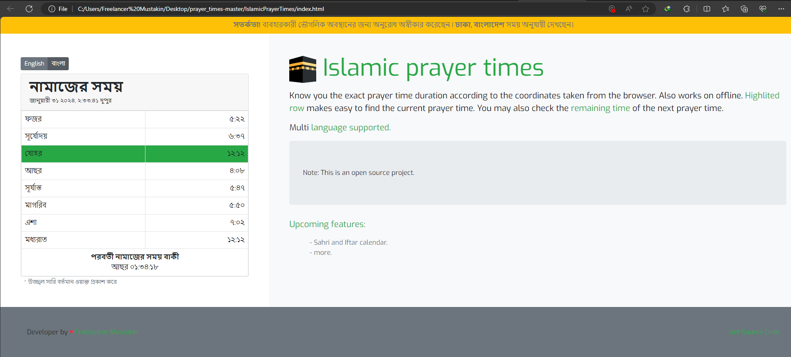

#  Islamic Prayer Times
Know the exact duration of Namaz according to the coordinates taken from the browser.

``ব্রাউজার থেকে নেওয়া স্থানাঙ্ক অনুসারে নামাজের সঠিক সময়কাল জানুন। অফলাইনেও কাজ করে। হাইলাইট করা সারি বর্তমান নামাজের সময় খুঁজে পাওয়া সহজ করে তোলে। আপনি পরবর্তী নামাজের সময়ের অবশিষ্ট সময়ও পরীক্ষা করতে পারেন।``

### Features!
- Works offline.
- Highlited row makes easy to find the current prayer time.
- Android Studio application support.
- You may also check the remaining time of the next prayer time.
- Know you the exact prayer time duration according to the coordinates taken from the browser.
- English & Bengali langugae support.

### Upcomming Features!
  - Sahri and Iftar calendar.
  - More.

### Screenshot

### Credits
- [aladhan-api](https://aladhan.com/prayer-times-api)
- [PrayTimes.org](http://praytimes.org/)
- [Moment.js](https://momentjs.com/)

### Author
- Developer by: [Freelancer Mustakin](https://freelancermustakin.github.io/)

### License
Prayer Times licensed under the  [MIT License]().
